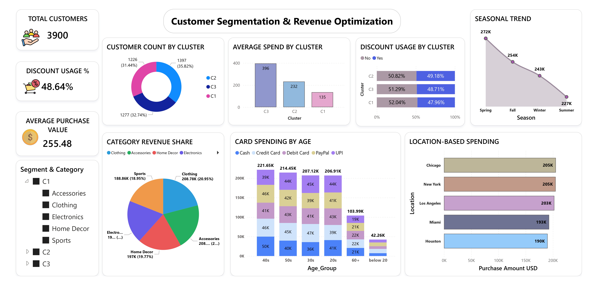

# 📊 Customer Segmentation & Revenue Optimization Dashboard

---

## 📊 Dashboard Preview

---

## 📌 Project Overview
This project analyzes U.S. retail customer purchase data (3,900+ records) to identify customer segments and optimize discount strategies.  
K-Means clustering was applied using Orange, and results were visualized in an interactive Power BI dashboard.

---

## 🎯 Business Objectives
- Identify product categories where discounts should be applied.
- Analyze card spending behavior across age groups.
- Explore seasonal and location-based revenue trends.
- Segment customers into value-based groups for targeted marketing.

---

## 🧠 Machine Learning Approach

### 🔹 Data Preprocessing
- Converted categorical variables using Continuize (Text → Numeric).
- Applied normalization to ensure fair clustering.
- Prepared structured dataset for clustering.

### 🔹 Clustering Technique
- Algorithm: **K-Means**
- Number of clusters: **3**
- Segments Identified:
  - C1 → Low Value Customers
  - C2 → Medium Value Customers
  - C3 → High Value Customers
- Evaluated cluster quality using Silhouette score.

---

## 📊 Power BI Dashboard Features

- Total Customers KPI
- Discount Usage %
- Average Purchase Value
- Customer Count by Cluster
- Seasonal Revenue Trend
- Location-Based Spending Analysis
- Category Revenue Share
- Card Spending by Age Group
- Discount Usage by Cluster

---

## 🔎 Key Insights

- C3 (High-Value) customers generate the highest average revenue.
- Overall discount usage is ~49%, indicating optimization opportunity.
- Spring season records peak sales.
- Age groups 40s and 50s contribute the highest spending.
- Chicago and New York are top revenue-generating locations.

---
## 🚀 Project Highlights

- ✔ 3 Customer Segments Identified
- ✔ 49% Discount Usage Analysis
- ✔ Seasonal Revenue Trend Analysis
- ✔ Location-Based Performance Insights
- ✔ Data-Driven Marketing Strategy Recommendations

## 💡 Business Recommendations

- Implement targeted discounts for low-value customers.
- Reduce blanket discounts for high-value customers.
- Launch seasonal campaigns before revenue decline.
- Apply geo-targeted marketing strategies in lower-performing regions.

---

## 🛠 Tools & Technologies Used

- Power BI
- DAX
- Orange (Machine Learning)
- K-Means Clustering
- Data Modeling
- Excel

---

## 📂 Repository Structure

- `Customer_segmentation_final.pbix` → Power BI Dashboard
- `Customer_segmentation.ows` → Orange ML Workflow
- `Customer_Segmentation_Raw_Data.xlsx` → Dataset
- `Customer_Segmentation_Analysis_Documentation.docx` → Project Documentation
- `Dashboard.jpg` → Screenshot

---

## 📈 Business Impact

This project demonstrates how data-driven segmentation and optimized discount strategies can improve marketing ROI, enhance customer retention, and increase overall profitability.

---

## 👨‍💻 Author
Anand Prajapati  
Aspiring Data Analyst | Power BI & Machine Learning Enthusiast
